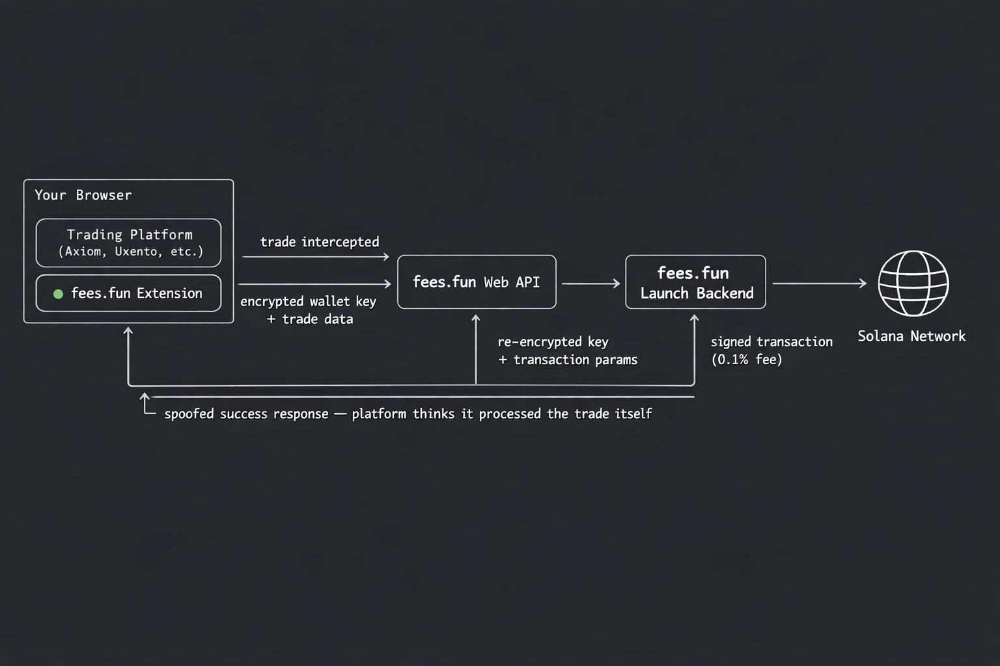

# fees.fun — Chrome Extension

Save fees. Track Twitter. Trade faster on Solana.

**fees.fun** is an open-source Chrome extension that reduces trading fees on Solana platforms. Swap fees on Axiom drop from 0.95% to **0.15–0.2%**, and deployer fees on launch platforms drop from 1–1.25% to **0.35%**. It works by intercepting trades at the browser level and routing them through our backend, cutting out the platform middleman fee while keeping everything functional.

> One extension. Works on Axiom, Uxento, RapidLaunch, J7Tracker — and more coming.

---

## how it works



1. **you click trade** — use axiom, uxento, rapidlaunch, or j7tracker as normal
2. **extension intercepts** — the request gets caught before hitting the platform's backend
3. **routed through fees.fun** — our backend builds the transaction with a 0.15–0.35% fee instead of the platform's 1%+
4. **platform sees nothing** — a spoofed success response goes back to the site. it thinks everything went normally

the platform never knows. your account stays clean. you keep the difference.

---

## architecture

the extension is a Chrome MV3 extension with multiple build targets:

```
src/
├── popup/              # react UI (settings, wallet management, savings dashboard)
│   ├── App.tsx
│   ├── components/
│   └── index.html
│
├── background/         # service worker (api calls, websocket, message routing)
│   └── background.ts
│
├── content/            # content script — bridges ISOLATED and MAIN worlds
│   └── content.ts
│
├── inject/             # MAIN world scripts — the interception layer
│   ├── rapidlaunch.ts      # RapidLaunch — intercepts fetch/XHR
│   ├── uxento.ts           # Uxento — intercepts WebSocket messages
│   ├── j7tracker.ts        # J7Tracker — intercepts WebSocket messages
│   ├── axiom.ts            # Axiom — patches JS source code before execution
│   └── shared/
│       └── interceptor-utils.ts
│
├── lib/                # shared utilities
│   ├── api.ts              # REST client for fees.fun backend
│   ├── auth.ts             # JWT token management
│   ├── wallet-cache.ts     # encrypted local key cache (AES-GCM + PBKDF2)
│   ├── solana.ts           # balance lookups via Helius RPC
│   ├── turnkey.ts          # Turnkey SDK for non-custodial key management
│   ├── platforms.ts        # platform definitions and fee configs
│   ├── storage.ts          # chrome.storage helpers
│   └── types.ts
│
└── public/
    ├── manifest.json
    ├── icons/
    └── rules/              # declarativeNetRequest rules (CSP modifications)
```

### interception methods by platform

| platform | method | what it does |
|---|---|---|
| **Axiom** | source patching | rewrites program addresses in axiom's JS before it executes. swaps their router for ours, their fee wallets for ours. uses MutationObserver + fetch override to catch all script loads |
| **RapidLaunch** | HTTP interception | proxies fetch() and XMLHttpRequest. deploy/sell/token-balance requests get forwarded to our backend with auth headers. launch listings get merged with our data |
| **Uxento** | WebSocket interception | proxies the WebSocket constructor and `.send()`. create/swap/dump_all events get routed through our WS proxy instead of uxento's backend |
| **J7Tracker** | WebSocket interception | same approach as uxento. intercepts `debug_request` events for `create_token` and `sell_token`, routes through our proxy |

### cross-world communication

chrome extensions have two isolated JS worlds. our scripts need to talk across them:

```
┌─────────────────────┐              ┌─────────────────────┐
│    MAIN world       │              │   ISOLATED world    │
│                     │  CustomEvent │                     │
│  rapidlaunch.ts     │◄────────────▶│  content.ts         │
│  uxento.ts          │  (channel    │                     │
│  j7tracker.ts       │   key is     │  reads auth token,  │
│  axiom.ts           │   random     │  wallet keys from   │
│                     │   per build) │  chrome.storage     │
│                     │              │                     │
└─────────────────────┘              └─────────────────────┘
```

the channel key is regenerated every build — it's a random string baked in by vite. the interceptors block page listeners from subscribing to events with that prefix, so the site can't eavesdrop.

### wallet security

your keys are managed by [Turnkey](https://turnkey.com) — the same infrastructure used by Coinbase and other major crypto companies. each user gets their own isolated sub-organization. keys never leave Turnkey's secure enclave in plaintext.

when the extension needs to sign a transaction, the key is exported encrypted (AES-256-GCM) and stays encrypted through every hop. you can verify this yourself in `src/lib/wallet-cache.ts`.

the code for all of this is readable in this repo — check for yourself.

### local signing vs server signing

the extension has a **local signing** toggle in settings (`popup/components/SettingsView.tsx`). this controls whether private keys ever leave the browser:

**local signing ON (default):**
- transactions are signed entirely in-browser using `src/lib/local-signer.ts`
- the wallet key is decrypted from the local AES-GCM cache, used to sign the transaction, then discarded from memory
- only the **signed transaction bytes** are sent to the backend for RPC submission
- **no private key material is ever transmitted** — not encrypted, not hashed, not in any form
- the interceptors explicitly skip the wallet key parameter:
  ```typescript
  // uxento.ts
  const walletParam = auth.localSigning ? "" : `&wallet=${encodeURIComponent(auth.walletKey)}`;
  ```
- the same pattern exists in every interceptor — when `localSigning` is true, wallet keys are omitted from all outbound requests

**local signing OFF (opt-in):**
- encrypted wallet keys (`{ct, iv}` AES-GCM ciphertext) are sent to the backend
- the backend decrypts, signs the transaction server-side, and submits to the Solana network
- this mode exists for users who want the backend to handle signing (e.g. multi-wallet bundle operations where signing N wallets client-side adds latency)

users control this toggle. the code paths are clearly separated and auditable.

### wallet key encryption details

private keys are never stored or transmitted in plaintext. the encryption scheme (`src/lib/wallet-cache.ts`):

- **algorithm:** AES-256-GCM via Web Crypto API (`crypto.subtle`)
- **key derivation:** PBKDF2 with 100,000 iterations, SHA-256, from build-time env vars (`VITE_WALLET_ENC_SECRET` + `VITE_WALLET_ENC_SALT`)
- **IV:** random 12-byte IV generated per encryption via `crypto.getRandomValues()`
- **storage:** encrypted keys stored in `chrome.storage.local` as `{ct, iv}` pairs (base64-encoded ciphertext + initialization vector)
- **decryption:** only happens locally in the browser when signing is needed — `getCachedKey()` decrypts on demand

### sniper wallets

users can configure up to 5 additional "sniper" wallets for bundle operations (buying with multiple wallets in the same block). these follow the exact same encryption and local-signing logic — when local signing is enabled, sniper wallet keys are also signed locally and never sent to the backend.

---

## why the code looks the way it does

this section explains patterns in the codebase that may look suspicious out of context but exist for legitimate technical reasons.

### "why does it intercept XHR/fetch/WebSocket?"

the entire product is fee reduction. to charge 0.15–0.35% instead of 1%+, the extension needs to catch outbound trade requests before they reach the platform's backend and route them through ours instead. there's no browser API to do this other than patching the network primitives (`XMLHttpRequest`, `fetch`, `WebSocket`) in the page's MAIN world context.

### "why does it replace Solana program addresses in Axiom's JS?"

axiom hardcodes their router program address and fee wallet addresses in their frontend JavaScript bundles. to route swaps through our lower-fee program, we patch these addresses before the code executes. the replacement program (`jewSBaKyd7...`) is our on-chain router that charges 0.15–0.2% instead of axiom's 0.95%. the replacement fee wallet (`jewish4HqE...`) is where that fee goes.

### "why does it modify CSP headers?"

Chrome MV3 content scripts injected into the MAIN world need permissive Content-Security-Policy headers. some target platforms have strict CSP that blocks our injected scripts. the DNR rules in `public/rules/` relax CSP on those specific domains so our interceptors can run. this is a standard pattern for MV3 extensions that need MAIN world access.

### "why does it spoof `isTrusted` and patch `toString()`?"

when the extension intercepts a request and sends a synthetic response back to the page, the page's JS may check `event.isTrusted` or call `fetch.toString()` to verify it's dealing with native browser behavior. if these checks fail, the platform knows an extension is present and can block the user. these patches ensure the page sees normal browser behavior and the user's account isn't flagged.

### "why does it filter the Performance API?"

`performance.getEntries()` exposes all network requests made by the page, including requests made by injected scripts. platforms can call this to detect unexpected network activity (requests to fees.fun endpoints). the shield filters these entries so only the platform's own expected requests are visible.

### "why does the server push text replacement rules?"

the background WebSocket receives `rules_update` and `apply_replacement` messages. these are **text-only** find/replace operations applied to visible DOM text via `TreeWalker` with `NodeFilter.SHOW_TEXT` and written back via `textNode.textContent`. this is not `innerHTML` — it cannot inject HTML elements, scripts, or execute code. it's used for cosmetic changes like branding and display names.

### "why does it send wallet data via CustomEvent?"

MAIN world scripts (interceptors) can't access `chrome.storage` — that's only available in the ISOLATED world. the content script reads auth tokens and wallet config from `chrome.storage`, then dispatches a `CustomEvent` with a per-build random channel key to pass this data to the MAIN world. `addEventListener` is patched to block page JS from listening on this channel, so the data is only accessible to our interceptors.

---

## supported platforms

| platform | type | fee without fees.fun | fee with fees.fun | status |
|---|---|---|---|---|
| [Axiom](https://axiom.trade) | swaps | 0.95% | 0.15–0.2% | live |
| [Uxento](https://uxento.io) | deploys | 1.25% | 0.35% | live |
| [RapidLaunch](https://rapidlaunch.io) | deploys | 1.00% | 0.35% | live |
| [J7Tracker](https://j7tracker.io) | deploys | 1.00% | 0.35% | live |

### referral program

users with a referral code earn **15%** of the fees generated by the people they refer. this is calculated and distributed on the backend — the extension itself doesn't handle referral logic.

more platforms added regularly. join the [discord](https://discord.gg/feesdotfun) to request new ones.

---

## install

### from release (recommended)

1. go to [**Releases**](https://github.com/feesdotfun/the-extension/releases)
2. download `extension.zip` from the latest release
3. unzip it
4. open `chrome://extensions` in chrome
5. enable **Developer mode** (top right)
6. click **Load unpacked** → select the unzipped folder
7. done — the fees.fun icon appears in your toolbar

### from source

```bash
pnpm install
node scripts/build.js
```

load `dist/` as unpacked extension in chrome.

---

## tech stack

- **chrome MV3** — manifest v3, service worker background
- **react 18** + **tailwind** — popup UI
- **vite 6** — multi-target build (popup, background, content, 5 inject scripts)
- **turnkey SDK** — non-custodial wallet infrastructure
- **@solana/web3.js** — balance lookups, transaction building
- **typescript** throughout

the backend (web API + launch server) is not open source. it handles transaction building, signing, RPC routing, and fee collection — publishing that would expose our infrastructure and make it trivial to bypass fees entirely or clone the service. the extension source is where all the user-facing logic lives and where trust matters most, which is why it's public.

---

## links

- [fees.fun](https://www.fees.fun) — main site
- [discord](https://discord.gg/feesdotfun) — community & support
- [twitter](https://x.com/feesdottfun) — twitter/x
- [releases](https://github.com/feesdotfun/the-extension/releases) — download latest build

---

## about this repo

this repo is auto-published from our private monorepo. commits here are just dated release snapshots, not individual changes — that's why every commit is "Release vYYYY.MM.DD". actual development happens in the main monorepo.

---

**fees.fun** — stop overpaying platforms. keep your SOL.
